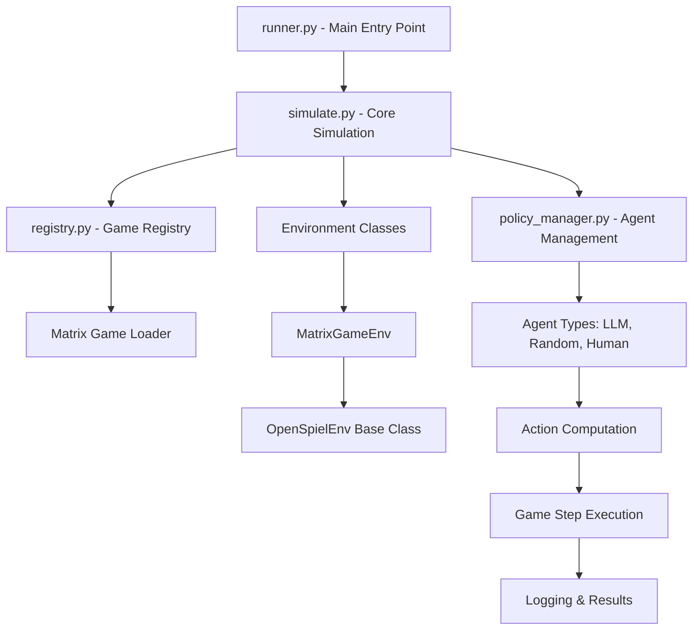
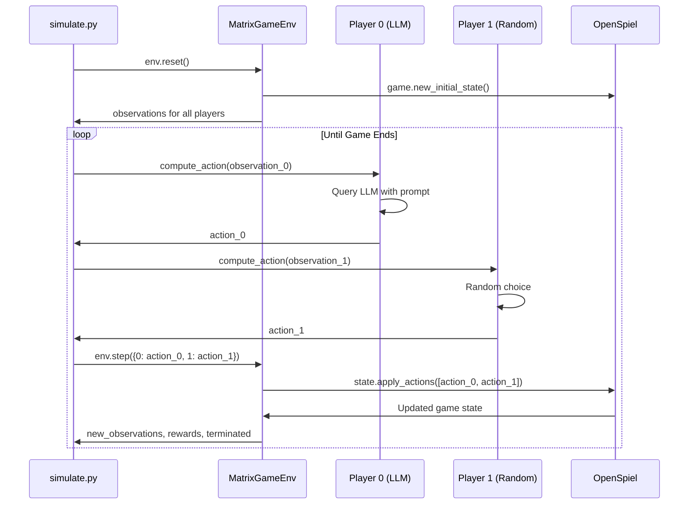

# Board Reasoning Arena Code Flow Analysis

## Overview
This document provides a comprehensive analysis of the information flow in the Board Reasoning Arena codebase, with special focus on **matrix games** (like Rock-Paper-Scissors, Prisoner's Dilemma, etc.).

## High-Level Architecture



## Detailed Information Flow

### 1. Entry Point: `runner.py`

**Key Functions:**
- `main()` - Parse CLI arguments and configuration
- `run_simulation()` - Orchestrate multiple games/episodes
- `initialize_ray()` - Setup parallel execution if enabled

**Flow for Matrix Games:**
```python
# 1. Parse configuration containing game specs
config = parse_config(args)

# 2. For each game in env_configs:
for game_config in game_configs:
    game_name = game_config["game_name"]  # e.g., "matrix_rps", "matrix_pd"

    # 3. Call simulate_game for each game
    simulate_game(game_name, game_specific_config, seed)
```

### 2. Core Simulation: `simulate.py`

**Key Functions:**
- `simulate_game()` - Main simulation loop
- `compute_actions()` - Handle both turn-based and simultaneous games
- `log_llm_action()` - Log agent decisions

**Matrix Game Specific Flow:**

```python
# 1. Initialize LLM backends
initialize_llm_registry()

# 2. Create agent policies for each player
policies_dict = initialize_policies(config, game_name, seed)
# Result: {"policy_0": LLMAgent, "policy_1": RandomAgent, ...}

# 3. Create environment from registry
env = registry.make_env(game_name, config)
# For matrix games: Creates MatrixGameEnv instance

# 4. Episode loop
for episode in range(config["num_episodes"]):
    observation_dict, _ = env.reset(seed=episode_seed)

    while not (terminated or truncated):
        # 5. Compute actions for all players
        action_dict = compute_actions(env, player_to_agent, observation_dict)

        # 6. Step environment forward
        observation_dict, rewards_dict, terminated, truncated, _ = env.step(action_dict)
```

### 3. Game Registry: `registry.py`

**Key Components:**
- `GameRegistration` class - Central registry for all games
- `register()` decorator - Used by game loaders
- `make_env()` - Factory method to create game environments

**Matrix Game Registration:**
```python
@registry.register(
    name="matrix_rps",  # Rock-Paper-Scissors
    module_path="arena.games.loaders",
    class_name="MatrixRPSLoader",
    environment_path="arena.envs.matrix_game_env.MatrixGameEnv",
    display_name="Matrix Rock Paper Scissors"
)
```

### 4. Policy Management: `policy_manager.py`

**Key Functions:**
- `initialize_policies()` - Create agent instances for each player
- `policy_mapping_fn()` - Map agent IDs to policy keys

**Agent Assignment for Matrix Games:**
```python
# For a 2-player matrix game:
policies = {
    "policy_0": LLMAgent(model_name="gpt-4", game_name="matrix_rps"),
    "policy_1": RandomAgent(seed=42)
}

# Mapping: player 0 -> policy_0, player 1 -> policy_1
```

### 5. Matrix Game Environment: `matrix_game_env.py`

**Inheritance Chain:**
```
MatrixGameEnv → OpenSpielEnv → ABC
```

**Key Methods:**

#### `__init__()`
```python
def __init__(self, game, game_name, player_types, max_game_rounds, seed):
    super().__init__(game, game_name, player_types, max_game_rounds, seed)
    # Inherits OpenSpiel game object and basic setup
```

#### `_state_to_observation()`
```python
def _state_to_observation(self) -> Dict[int, Dict[str, Any]]:
    observations = {}
    for player_id in range(self.state.num_players()):
        observations[player_id] = {
            "state_string": f"Matrix game - Player {player_id}",
            "legal_actions": self.state.legal_actions(player_id),
            "prompt": self._generate_prompt(player_id)
        }
    return observations
```

#### `_generate_prompt()`
```python
def _generate_prompt(self, agent_id: int) -> str:
    # Get available actions (e.g., Rock=0, Paper=1, Scissors=2)
    legal_actions = self.state.legal_actions(agent_id)
    action_descriptions = []
    for action in legal_actions:
        action_name = self.state.action_to_string(agent_id, action)
        action_descriptions.append(f"{action}: {action_name}")

    prompt = f"""You are Player {agent_id} in the game: {self.game_name}
Available actions:
{action_list}
What action do you choose? Reply only with the action number."""

    return prompt
```

### 6. Base Environment: `open_spiel_env.py`

**Key Methods for Matrix Games:**

#### `reset()`
```python
def reset(self, seed=None) -> Tuple[str, Dict[str, Any]]:
    self.state = self.game.new_initial_state()
    self._solve_chance_nodes()  # Handle any random setup
    return self._state_to_observation(), self.info
```

#### `step()`
```python
def step(self, action_dict: Dict[int, int]):
    # Matrix games are simultaneous-move games
    if self.state.is_simultaneous_node():
        actions = [action_dict[player] for player in sorted(action_dict.keys())]
        self.state.apply_actions(actions)  # All players act simultaneously

    # Compute rewards for each player
    reward_dict = self._compute_reward()

    # Check if game ended
    self.terminated = self.state.is_terminal()

    return observation_dict, reward_dict, self.terminated, self.truncated, self.info
```

### 7. Agent Types

#### LLM Agent (`llm_agent.py`)
```python
class LLMAgent(BaseAgent):
    def compute_action(self, observation: Dict[str, Any]) -> int:
        prompt = observation.get("prompt")

        # Use Ray for parallel inference if available
        if ray.is_initialized():
            action_dict = ray.get(batch_llm_decide_moves_ray.remote(...))
        else:
            action_dict = batch_llm_decide_moves(...)

        return {"action": chosen_action, "reasoning": reasoning}
```

#### Random Agent (`random_agent.py`)
```python
class RandomAgent(BaseAgent):
    def compute_action(self, observation: Dict[str, Any]) -> int:
        legal_actions = observation["legal_actions"]
        return random.choice(legal_actions)
```

## Matrix Game Execution Flow

### Simultaneous Action Handling



### Action Computation in `compute_actions()`

```python
def compute_actions(env, player_to_agent, observations):
    if env.state.is_simultaneous_node():
        # Matrix games: All players act simultaneously
        return {
            player: extract_action(player_to_agent[player](observations[player]))
            for player in player_to_agent
        }
    else:
        # Turn-based games: Only current player acts
        current_player = env.state.current_player()
        return {
            current_player: extract_action(
                player_to_agent[current_player](observations[current_player])
            )
        }
```

## Matrix Game Examples

### Rock-Paper-Scissors
- **Game Name:** `matrix_rps`
- **Actions:** 0=Rock, 1=Paper, 2=Scissors
- **Players:** 2 (simultaneous moves)
- **Rewards:** Win=+1, Lose=-1, Tie=0

### Prisoner's Dilemma
- **Game Name:** `matrix_pd`
- **Actions:** 0=Cooperate, 1=Defect
- **Players:** 2 (simultaneous moves)
- **Rewards:** Based on classic payoff matrix

### Matching Pennies
- **Game Name:** `matching_pennies`
- **Actions:** 0=Heads, 1=Tails
- **Players:** 2 (simultaneous moves)
- **Rewards:** Zero-sum game

## Key Data Structures

### Configuration Format
```python
config = {
    "env_configs": [
        {
            "game_name": "matrix_rps",
            "max_game_rounds": 10,
            "output_path": "results/matrix_rps_results.json"
        }
    ],
    "agents": {
        "player_0": {"type": "llm", "model": "gpt-4"},
        "player_1": {"type": "random"}
    },
    "num_episodes": 100,
    "use_ray": True
}
```

### Observation Dictionary
```python
observation = {
    "state_string": "Matrix game - Player 0",
    "legal_actions": [0, 1, 2],  # Rock, Paper, Scissors
    "prompt": "You are Player 0 in matrix_rps...\nAvailable actions:\n0: Rock\n1: Paper\n2: Scissors"
}
```

### Action Dictionary
```python
action_dict = {
    0: 1,  # Player 0 chooses Paper
    1: 2   # Player 1 chooses Scissors
}
```

## Logging and Results

### Agent Logging
- **SQLiteLogger:** Records moves, reasoning, illegal actions
- **TensorBoard:** Real-time metrics and visualizations
- **File Logging:** Detailed execution logs

### Output Files
- **JSON Results:** Game outcomes, scores, metadata
- **CSV Logs:** Merged logs for analysis
- **Database:** SQLite storage for agent performance

This flow ensures that matrix games are handled as simultaneous-move games where all players submit actions at once, then the environment processes them together using OpenSpiel's `apply_actions()` method.
